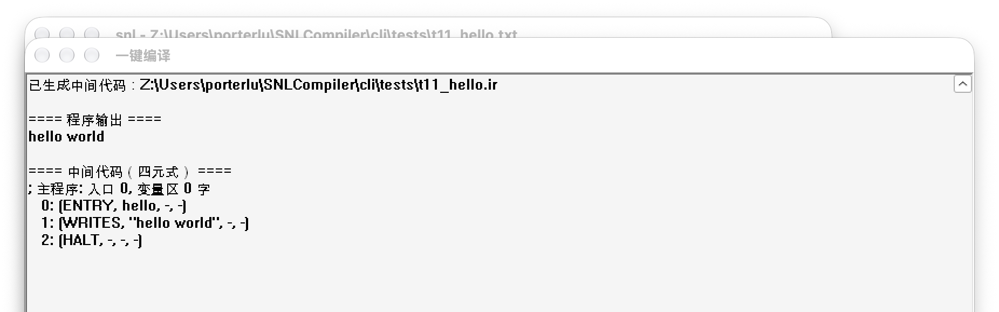

## SNL Compiler

This is an SNL language compiler written by our group. It runs lexical, syntax, and semantic
analysis, generates intermediate code (quadruples), and executes that code on a small virtual
machine.

## Build and test on macOS / Linux

Only the Win32 GUI in `SNL_COMPILER/main.cpp` depends on Windows. The lexer and parser build as a
command-line tool with clang or gcc:

```sh
cd cli
make          # builds build/snl_cli
make test     # runs tests/*.txt  (t* must parse, e* must report an error)
./build/snl_cli tests/t02_expr.txt
```

The tool prints the token list, the LL(1) analysis steps, the syntax tree, and the quadruples it
generates from the tree, and writes those quadruples to `<source>.ir`. With `--run` it executes
them on the built-in virtual machine, reading from stdin and writing to stdout. `make test` builds
every `tests/t*.txt`, runs it with `tests/<name>.in`, and compares the output against
`tests/<name>.expected`; the `tests/e*.txt` cases must fail to compile.

The sources are UTF-8 with CRLF line endings. The Windows build passes
`-finput-charset=UTF-8 -fexec-charset=GBK` so the ANSI GUI still shows Chinese correctly, and the
Code::Blocks project sets the same options.

### Hello world

One extension to standard SNL is `write("text")`, which prints a string constant, so a hello world
program is just:

```snl
program hello
begin
   write("hello world")
end.
```

Open it in the GUI and choose 编译 → 一键编译 (one-click compile). The window below shows the program
output `hello world` and the quadruples, which the compiler also saves to `<source>.ir`. You can
also pass the file on the command line, and the GUI compiles and runs it on launch.



The same program on the command line:

```sh
cd cli && make
./build/snl_cli tests/t11_hello.txt --run
```

`cli/tests/t12_add.txt` reads two numbers and writes their sum. In the GUI a `read` pauses the run,
and a dialog asks for each value.

## Running the Windows GUI on macOS with Wine

```sh
# Wine: the Homebrew wine casks are disabled; install the WineHQ build from
# https://github.com/Gcenx/macOS_Wine_builds/releases  (unpack, move "Wine Stable.app" to /Applications)
export PATH="/Applications/Wine Stable.app/Contents/Resources/wine/bin:$PATH"
sh cli/wine-cjk-fonts.sh                     # once per Wine prefix, otherwise Chinese text shows as boxes
brew install mingw-w64 && make -C cli win    # rebuild the GUI exe from the current sources
LANG=zh_CN.UTF-8 wine cli/build/win/SNL_COMPILER.exe
```
